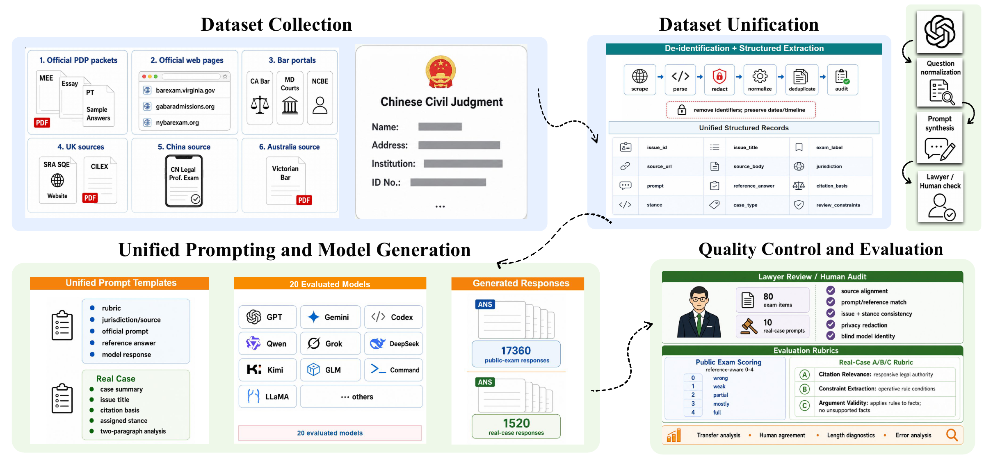

# LegalScope: Measuring Exam-to-Case Transfer in LLM Legal Reasoning

LegalScope studies a simple question with high stakes for legal AI evaluation:
do strong public legal-exam scores actually transfer to real-case legal reasoning?

LegalScope pairs scalable public legal-exam tasks with lawyer-reviewed,
de-identified Chinese civil judgment analysis. The public repository is intentionally
a preview: it documents the research question, benchmark design, evaluation counts,
scoring protocol, release boundary, and reproducible helper code without publishing
the paper draft, full workbook, model outputs, human review sheets, or
non-de-identified case materials.

## Start Here

| If you want to understand... | Read |
| --- | --- |
| The research idea and motivation | [Project Brief](docs/PROJECT_BRIEF.md) |
| Main empirical findings and figures | [Results Summary](docs/RESULTS_SUMMARY.md) |
| Dataset scope and release boundary | [Data Card](docs/DATA_CARD.md) |
| Scoring design | [Scoring Rubric](docs/SCORING_RUBRIC.md) |
| Human validation protocol | [Annotation Protocol](docs/ANNOTATION_PROTOCOL.md) |

## Benchmark at a Glance



| Component | Count |
| --- | ---: |
| Public legal-exam questions | 868 |
| Real-case issue-stance prompts | 76 |
| De-identified Chinese civil judgments | 15 |
| Legal issues extracted from judgments | 38 |
| Model groups evaluated | 20 |
| Public-exam model responses | 17,360 |
| Real-case model responses | 1,520 |
| Total dataset model responses | 18,880 |
| Human-validation responses | 1,800 |

The pipeline figure above is rendered from `8.pdf`, which is referenced by the paper
source. The full paper PDF is not committed to this repository.

## Main Findings

- Public-exam scores correlate with Chinese real-case scores at the model level
  (Pearson `r = 0.835`, Spearman `rho = 0.661`), but rankings and reasoning-mode gains
  do not transfer uniformly.
- Real-case legal reasoning exposes a constraint-extraction bottleneck: models write
  fluent legal arguments more easily than they recover the operative legal and factual
  conditions that control those arguments.
- Automated evaluation aligns strongly with human review on public-exam answers
  (answer-level Pearson `r = 0.925`) but weakens on real-case analysis
  (`r = 0.450`), showing why expert-grounded evaluation remains important.

## Repository Map

```text
assets/figures/
  paper_collection_pipeline.png
  paper_score_distribution.png
  paper_transfer_model_judge.png
  paper_transfer_human.png
data/
  README.md
  metadata/dataset_summary.json
  metadata/model_groups.csv
  metadata/source_composition.csv
  sample/README.md
docs/
  PROJECT_BRIEF.md
  RESULTS_SUMMARY.md
  DATA_CARD.md
  SCORING_RUBRIC.md
  ANNOTATION_PROTOCOL.md
  AI_WORKFLOW.md
  FIGURE_SOURCES.md
  RELEASE_STATUS.md
scripts/
  extract_public_sample.py
src/legalscope/
  workbook.py
tests/
  test_workbook.py
```

## Public Release Boundary

This repository does not publish:

- the paper draft or PDF;
- the full benchmark workbook;
- complete prompts, reference answers, model answers, or row-level model-output
  matrices;
- lawyer review sheets or adjudication notes;
- non-de-identified judgments or private source documents.

The public code is a reproducibility scaffold for collaborators with authorized local
access to the private workbook. It is not enough to reconstruct the full benchmark from
the public repository alone.

## Disclaimer

LegalScope is a research benchmark for model evaluation. It is not legal advice, a
legal research product, or a substitute for jurisdiction-specific legal review.
