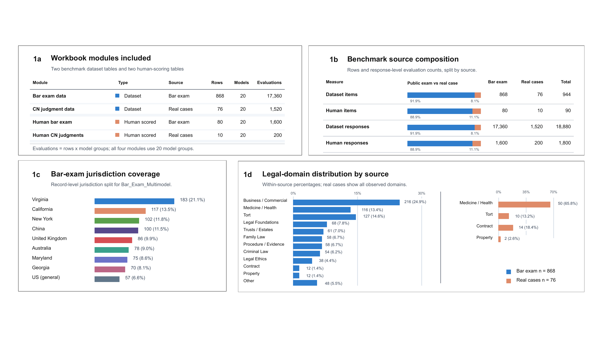
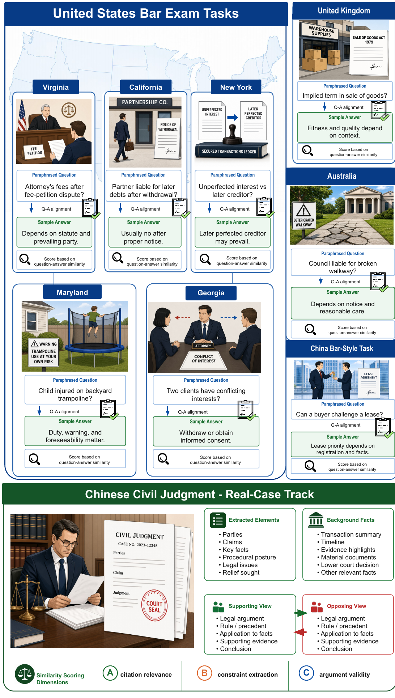
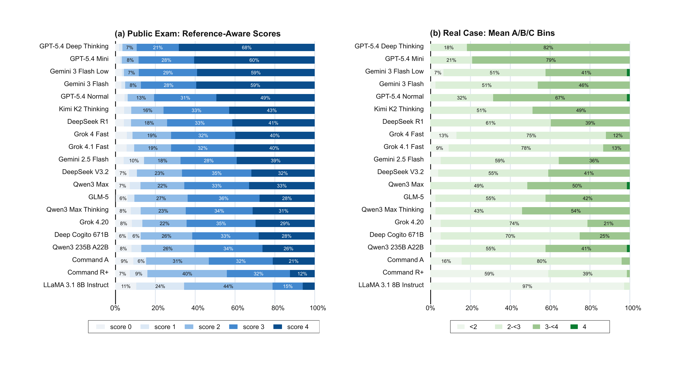
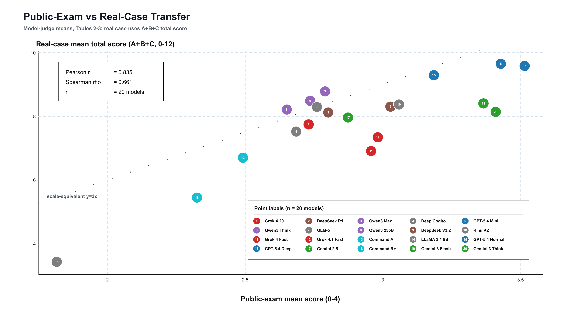
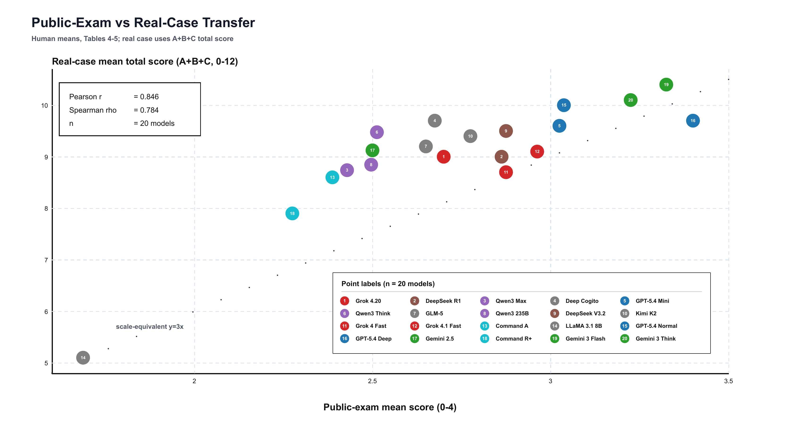

# LegalScope

LegalScope is a legal LLM evaluation benchmark for testing whether performance on
public legal-exam questions transfers to real-case legal reasoning. The V2 benchmark
combines 868 open-ended bar-exam style questions with 76 lawyer-reviewed
issue-stance prompts derived from 15 de-identified Chinese civil judgments.

This repository is a public preview and reproducibility scaffold. It intentionally
does not include the full manuscript, full workbook, full prompt matrix, complete
model outputs, human-review sheets, or any non-de-identified judgments while release,
privacy, licensing, and review constraints are being checked.

## Status

V2 is the current project snapshot. Old draft figures, old counts, and manuscript
draft files have been removed from this repository. All committed figure files are
rendered from the V2 exports in the project Drive figure folder.

## V2 Snapshot

| Module | Source | Rows | Model groups | Evaluations |
| --- | --- | ---: | ---: | ---: |
| Bar exam data | Public legal exams | 868 | 20 | 17,360 |
| CN judgment data | Real cases | 76 | 20 | 1,520 |
| Human bar exam | Human scored public exams | 80 | 20 | 1,600 |
| Human CN judgments | Human scored real cases | 10 | 20 | 200 |

Additional structure:

| Dimension | V2 value |
| --- | ---: |
| Dataset items | 944 |
| Dataset model responses | 18,880 |
| Human-validation responses | 1,800 |
| De-identified Chinese civil judgments | 15 |
| Real-case legal issues | 38 |
| Real-case issue-stance prompts | 76 |

## Research Questions

1. Do public-exam scores predict real-case legal reasoning performance?
2. Where do models fail when the task moves from reference-answer matching to
   stance-aware case analysis?
3. How reliable are automated and model-judge scores when compared with human legal
   review?

## V2 Figures

**Dataset composition.**



**Task distribution overview.**



**Score distribution by model group.**



**Public-exam to real-case transfer, model-judge means.**



**Public-exam to real-case transfer, human means.**



## Current Findings

The V2 analysis finds a positive model-level relationship between public-exam and
real-case scores, but not a complete transfer. Model-judge means show Pearson
`r = 0.835` and Spearman `rho = 0.661`; human means show Pearson `r = 0.846` and
Spearman `rho = 0.784`. The real-case track exposes a different bottleneck:
constraint extraction is weaker than citation relevance and argument validity, and
model-judge reliability is less stable on case-based legal analysis than on
reference-answer exam scoring.

## Repository Map

```text
assets/figures/
  v2_dataset_composition.png
  v2_task_distribution_overview.png
  v2_score_distribution.png
  v2_model_judge_transfer.png
  v2_human_transfer.png
data/
  README.md
  metadata/dataset_summary.json
  metadata/model_groups.csv
  metadata/source_composition.csv
  sample/README.md
docs/
  DATA_CARD.md
  SCORING_RUBRIC.md
  ANNOTATION_PROTOCOL.md
  AI_WORKFLOW.md
  FIGURE_SOURCES.md
  RELEASE_STATUS.md
scripts/
  extract_public_sample.py
src/legalscope/
  workbook.py
tests/
  test_workbook.py
```

## What Is Not Public Here

This repository does not publish:

- the paper draft or source files;
- the full V2 workbook;
- complete prompts, reference answers, model answers, or row-level model-output
  matrices;
- lawyer review sheets or adjudication notes;
- non-de-identified judgments or private source documents.

The public scripts are retained as lightweight utilities for collaborators who have
local access to the private workbook. They are not enough to reproduce the full
benchmark from the public repository alone.

## Disclaimer

LegalScope is a research benchmark for model evaluation. It is not legal advice, a
legal research product, or a substitute for jurisdiction-specific legal review.
