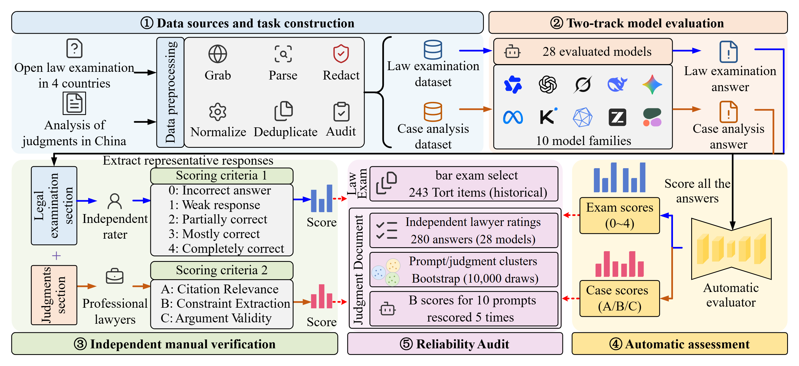

# LegalScope: Measuring Exam-to-Case Transfer in LLM Legal Reasoning

**AI Measurement Science (AIMS) Workshop at COLM 2026**

[Project page](https://eternwang.github.io/LegalScope/) ·
[Paper](https://openreview.net/forum?id=BNx62Wx1ej) ·
[Hugging Face](https://huggingface.co/datasets/Hongyu801/LegalScope) ·
[Results](docs/RESULTS_SUMMARY.md) · [Data card](docs/DATA_CARD.md) ·
[Version notes](docs/RELEASE_STATUS.md) · [Citation](#citation)

LegalScope asks whether strong public legal-exam scores transfer to real-case legal
reasoning. It pairs public exams from four jurisdictions with lawyer-reviewed,
paired-stance prompts derived from de-identified Chinese judgments.

This repository links the **AIMS at COLM 2026 workshop paper**. Its benchmark
counts, original overview figure and all 252 aggregate score values for 28 model
groups were rechecked against the current manuscript on **October 8, 2026**;
the reported numerical results are unchanged. It provides documentation, paper
figures, aggregate results, metadata, and workbook helpers.
The full dataset is not released here.

**Downloadable now:** 78 Victorian Bar source-excerpt records with selected
candidate answers, plus benchmark metadata. Start with the
[source dataset](https://huggingface.co/datasets/Hongyu801/LegalScope/viewer/victorian_bar_source_excerpts/source)
and the [loading and field guide](docs/USING_THE_RELEASE.md).

## Benchmark at a Glance

<a href="assets/figures/paper_collection_pipeline.png"></a>

| Component | Count |
| --- | ---: |
| Public legal-exam questions | 861 |
| Real-case issue-stance prompts | 276 |
| De-identified Chinese judgments | 56 |
| Legal issues, each with support and opposition prompts | 138 |
| Model groups evaluated | 28 |
| Public-exam model responses | 24,108 |
| Real-case model responses | 7,728 |
| Total dataset model responses | 31,836 |
| Unique human-validation responses | 2,520 |

Human validation covers 80 exam items (2,240 answers) and 10 case prompts (280
answers). Two lawyers score the same case answers; their ratings do not double the
unique-answer count. Historical controls and fixed-answer audits in the pipeline
are separate from the full benchmark; see the [results](docs/RESULTS_SUMMARY.md).

## Main Findings

- Exam and case scores are associated across the 28 model groups: Pearson
  `r = 0.817`, Spearman `rho = 0.708`. Rankings and variant gains do not transfer
  uniformly between the tracks.
- Mean scores are `72.6` for public exams and `73.0` for real cases on the 0-100
  scale. The tracks use different scoring protocols; these means do not equate
  their difficulty.
- Citation relevance averages `66.9`, below argument validity at `72.6`.
  Lawyers show the same direction descriptively, but the pooled lawyer gap's
  95% interval crosses zero. This is not evidence of a universal dimension ordering.
- Automatic scoring agrees more strongly with human review on exam answers
  (`r = 0.910`) than case answers (`r = 0.312`, pooled lawyers).

## Explore the Project

| Topic | Resource |
| --- | --- |
| Research question and benchmark design | [Project brief](docs/PROJECT_BRIEF.md) |
| Findings, figures, and uncertainty | [Results summary](docs/RESULTS_SUMMARY.md) |
| Counts, sources, and intended use | [Data card](docs/DATA_CARD.md) |
| Downloads, field meanings, answer types, and examples | [Using the release](docs/USING_THE_RELEASE.md) |
| Reference-answer scoring and calibrated case rubric | [Scoring rubric](docs/SCORING_RUBRIC.md) |
| Independent reviewers and lawyer agreement | [Annotation protocol](docs/ANNOTATION_PROTOCOL.md) |
| Model roster and paper Table 3 | [Model groups](data/metadata/model_groups.csv), [aggregate performance](data/metadata/model_performance.csv) |
| Machine-readable composition | [Dataset summary](data/metadata/dataset_summary.json), [source composition](data/metadata/source_composition.csv) |
| Figure provenance and version history | [Figure sources](docs/FIGURE_SOURCES.md), [release status](docs/RELEASE_STATUS.md) |

## Code and Reproducibility

`src/legalscope/workbook.py` contains workbook inspection helpers;
`scripts/extract_public_sample.py` is a collaborator utility for an authorized
local workbook. It has not been rerun against the workshop workbook in this
documentation update. Its generated metadata is not the versioned paper metadata
above, and generated samples require release review.

The legacy exporter now defaults to ignored `data/private/legacy-preview/`,
refuses public repository paths and nonempty output directories, and treats a
sample size of zero as no records. Its abbreviated or translated previews do
not establish permission to redistribute source material. Installation below
also installs the local helper package so script imports work from a fresh clone.

```bash
python -m pip install -r requirements.txt
python -m pytest -q
```

For the reviewed public Hugging Face package, `scripts/prepare_hf_tables.py`
creates lossless Parquet loader tables from the original CSV/JSONL files. Install
`python -m pip install -e ".[release]"`, then run
`python scripts/prepare_hf_tables.py --package-dir /path/to/reviewed-package`.
The utility verifies the source manifest and round-trips every converted value;
it does not extract new data from a private workbook or clear new source rights.

This repository alone cannot reproduce the complete evaluation: the full workbook,
prompt/reference matrix, model responses, and human review sheets are not included.

## Public Release Boundary

The complete benchmark is larger than the downloadable release. The repository
contains metadata and aggregate results; the project page also shows an attributed
Victorian Bar question-and-answer excerpt under **CC BY-NC-ND 4.0**. That excerpt
is not covered by this repository's MIT license. See
[third-party notices](THIRD_PARTY_NOTICES.txt).

A separate 78-item Victorian Bar source-excerpt package is published at
[Hongyu801/LegalScope](https://huggingface.co/datasets/Hongyu801/LegalScope).
It retains the original source license, attribution, publication links and
selected candidate answers. Four independent Parquet configurations support
dataset loading; original CSV and JSONL downloads are also available. The other 783 exam records
are not cleared for this source-text release. The 276 derived case prompts remain
outside the public data package pending per-case provenance and privacy review.
This does not mean that all public judgments are prohibited from reuse.
Project-authored anonymized prompts and answers can be considered for release
item by item. Missing an open-license label on a judgment is not itself a ban;
the remaining source, privacy, and answer-specific checks are described in the
[case publication status](docs/USING_THE_RELEASE.md#case-publication-status).

Full model-output matrices, lawyer review sheets, source judgments, private
workbooks and the manuscript source package are not published. The paper is linked
above. See [release status](docs/RELEASE_STATUS.md) for details.

## Citation

```bibtex
@inproceedings{wang2026legalscope,
  title = {{LegalScope}: Measuring Exam-to-Case Transfer in {LLM} Legal Reasoning},
  author = {Wang, Hongyu and Han, Rilyn R. and Zhao, Yilun and Zhao, Xuandong and Cohan, Arman},
  booktitle = {AI Measurement Science Workshop at COLM 2026},
  year = {2026},
  url = {https://openreview.net/forum?id=BNx62Wx1ej}
}
```

LegalScope is a research benchmark, not legal advice or a substitute for
jurisdiction-specific legal review.
