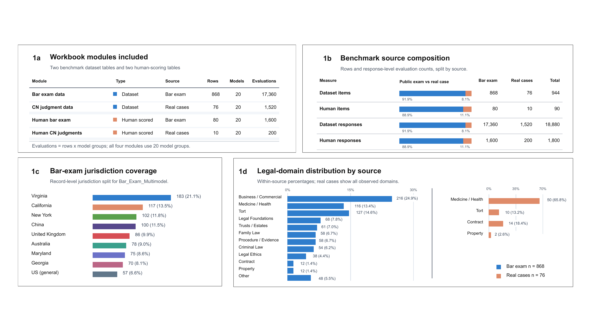
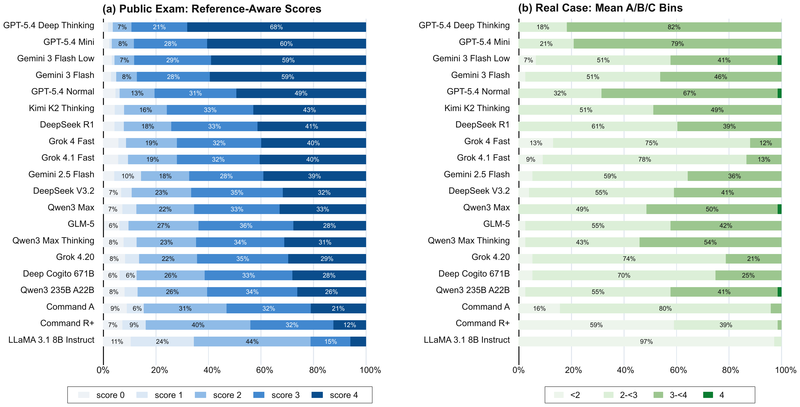
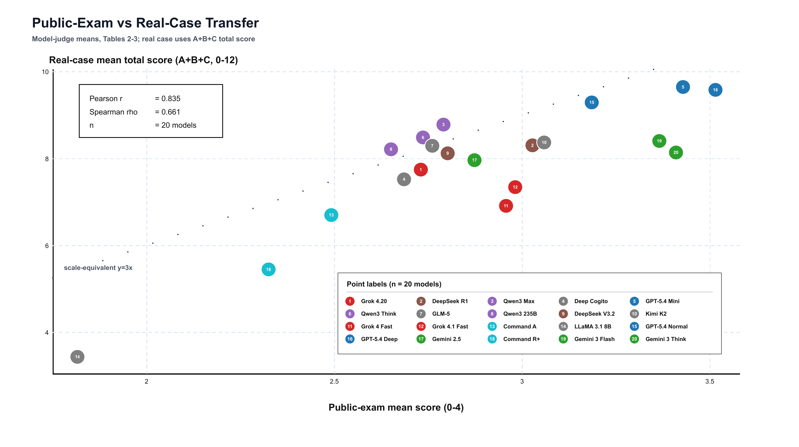
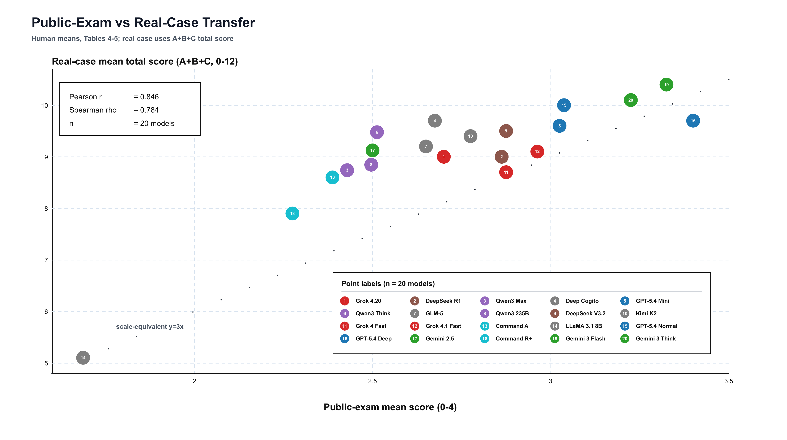

# Results Summary

This page summarizes the public-facing results without releasing the full paper or the
full response matrix.

## Dataset Composition

LegalScope contains 944 dataset items and 18,880 model responses across 20 model
groups. It combines a large public-exam track with a smaller but more diagnostic
lawyer-reviewed real-case track.

## Score Distribution

The score distribution shows that public-exam scoring and real-case scoring stress
different abilities. In the real-case track, models often reach moderate or high
argument-validity scores while still losing points on constraint extraction.

## Exam-to-Case Transfer: Model-Judge Scores

Public-exam performance is positively related to real-case performance, but the
relationship is not deterministic:

| Transfer metric | Value |
| --- | ---: |
| Pearson correlation | 0.835 |
| Spearman correlation | 0.661 |
| Model groups | 20 |

This supports the main claim: public legal exams are useful signals, but they should
not be treated as a complete substitute for expert-grounded real-case diagnostics.

## Exam-to-Case Transfer: Human Scores

The human-scored subset shows the same broad pattern with stronger rank alignment:

| Transfer metric | Value |
| --- | ---: |
| Pearson correlation | 0.846 |
| Spearman correlation | 0.784 |
| Model groups | 20 |

## Human Validation

Automated evaluation aligns strongly with human review on public-exam answers
(`r = 0.925` at the answer level) but weakens on real-case analysis (`r = 0.450`).
The gap is expected: real-case legal analysis depends on case-specific facts, stance
requirements, hidden evidence boundaries, and legal judgment that are harder to reduce
to a scalable scoring protocol.
