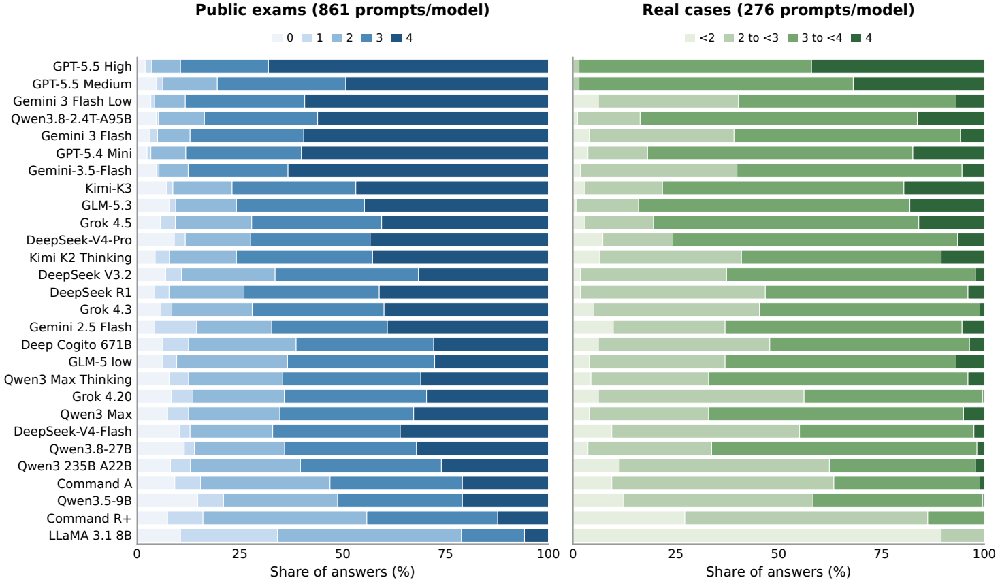
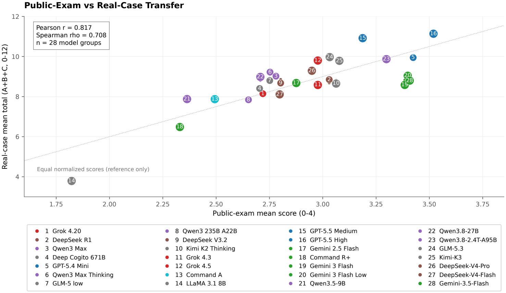
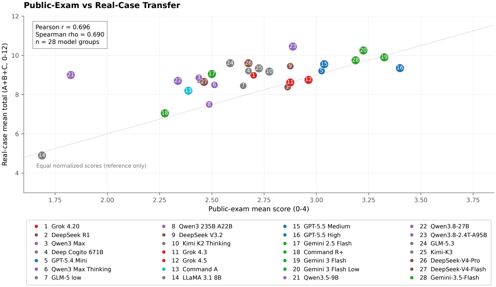
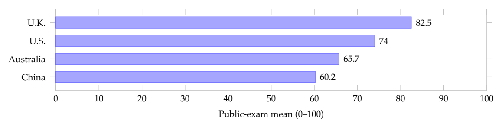

# Results Summary

Results below follow the [AIMS at COLM 2026 workshop paper](https://openreview.net/forum?id=BNx62Wx1ej).
Section, table, and figure references use that version. Published Table 3 values
are also available as [CSV](../data/metadata/model_performance.csv); they are rounded
aggregate values, not the underlying response matrix.

## Headline Performance

Across 28 model groups, the public-exam mean is `72.6` and the real-case mean is
`73.0` on the 0-100 scale (Section 5.2).

| Real-case dimension | Mean |
| --- | ---: |
| Citation relevance | 66.9 |
| Constraint extraction | 79.3 |
| Argument validity | 72.6 |

Citation relevance receives a lower mean than argument validity. The dimensions
measure different properties, so this contrast does not establish an intrinsic
difficulty hierarchy. Scores also do not equate difficulty between exam and case
tracks.

## Score Distribution

Constraint extraction has `11.9%` of scores at 2 and `48.9%` at 4; argument validity
has `45.0%` at 3 and `24.7%` at 4 (Table 13). Figure 2 describes answer quality,
not repeated-scoring stability.

## Exam-to-Case Association

| Scoring endpoint | Model groups | Pearson | Spearman |
| --- | ---: | ---: | ---: |
| Automatic exam and case means | 28 | 0.817 | 0.708 |
| Human exam and pooled lawyer case means on validation subsets | 28 | 0.696 | 0.690 |

Both Figure 3 panels measure exam-to-case association, not automatic-human
agreement. The diagonal is an equal-normalized-score reference, not an ability-loss
threshold. The human panel uses the equal-weight mean of both lawyers.

The Chinese exam subset gives `r = 0.788`, `rho = 0.704`; the English aggregate
gives `r = 0.813`, `rho = 0.670` (Table 4). Source and task composition prevent
isolating language or legal-system effects from these comparisons.

Variant differences do not transfer uniformly: GPT-5.5 High exceeds GPT-5.4 Mini by
`2.4` exam points and `9.9` case points, while DeepSeek R1 exceeds DeepSeek V3.2 by
`5.7` exam points but scores `1.5` case points lower (Table 6). These comparisons mix
checkpoint, size, and reasoning-mode differences; they do not isolate reasoning effort.

## Source and Case Categories

| Public-exam group | N | Mean |
| --- | ---: | ---: |
| United Kingdom | 86 | 82.5 |
| United States | 603 | 74.0 |
| Australia | 78 | 65.7 |
| China | 94 | 60.2 |

These are source and format effects, not intrinsic jurisdictional difficulty.

| Real-case category | Prompts | Mean |
| --- | ---: | ---: |
| Tort | 80 | 71.9 |
| Contract | 72 | 73.4 |
| Criminal | 54 | 74.0 |
| Intellectual Property | 34 | 73.7 |
| Administrative | 22 | 70.9 |
| Civil Procedure | 8 | 70.3 |
| Property | 6 | 77.7 |

Table 5 shows lower mean citation relevance than argument validity in all seven
categories. Tort is 29.0% of case prompts; medical-malpractice prompts are 18.1%.

## Human Validation

| Validation set | Answer-level Pearson | Answer-level Spearman | Model-level Pearson | Model-level Spearman |
| --- | ---: | ---: | ---: | ---: |
| Public exams | 0.910 | 0.898 | 0.948 | 0.963 |
| Real cases, pooled lawyers | 0.312 | 0.235 | 0.703 | 0.459 |

The 80-item exam subset contains 2,240 answers; the 10-prompt case subset contains
280 answers (Section 6.5 and Table 7). The case human score is the equal-weight mean
of two independent lawyers; Lawyer 2 was held out from rubric calibration.

Pooled lawyer means for citation, constraint, and argument are `71.65`, `73.35`, and
`76.79`. Argument minus citation has a reported gap of `5.13` points and a
prompt-cluster 95% interval of `[-0.94, 11.07]`. Both lawyers show a positive point
estimate, but the pooled and Lawyer 2 intervals cross zero. There is no claim of a
consistent constraint-extraction ordering.

## Reliability Audits and Historical Results

The current citation-argument analysis uses all 276 prompts, 56 judgments, and 28
models (7,728 answers), with 10,000 cluster-bootstrap draws (Appendix B.6, Table 20).
The automatic gap is `5.69`, with prompt-cluster 95% CI `[4.51, 6.83]` and
judgment-cluster CI `[4.44, 6.92]`. Giving judgments equal weight yields `6.02`,
CI `[4.84, 7.17]`. Human resampling retains both lawyers and all 28 models within
each of the 10 prompt clusters. Transfer intervals separately resample model
groups and are conditional on the roster, without accounting for family dependence.

The paper retains a historical T1 audit of 76 prompts and 20 models, along with
historical Tort/language/C-Eval controls that use the earlier case endpoint. They
are not recomputations of the expanded benchmark. In particular, the historical
243-item Tort control differs from the current 242-item exam category.

The fixed-answer audit still uses 200 answers rescored five times. Historical A/C
and updated B come from separate batches, not a jointly rerun A/B/C experiment.
Updated B has `45.0%` exact agreement, `75.5%` range-at-most-one, mean pairwise QWK
`0.802`, and mean answer SD `0.372` (Table 21). These audits measure evaluator
variance, not accuracy or generation variance; repeated scores do not enter the
headline results.
